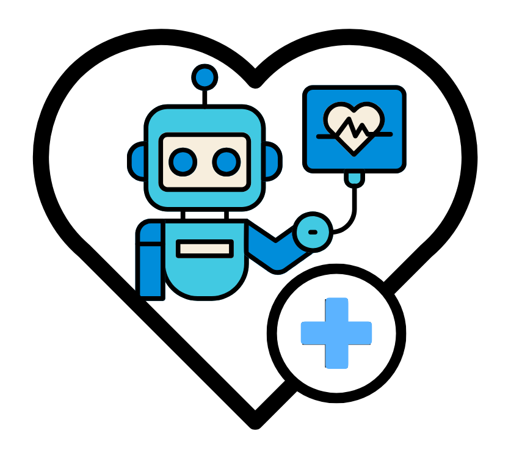
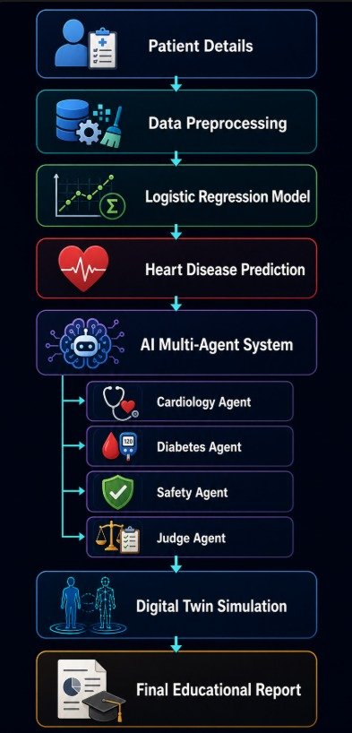
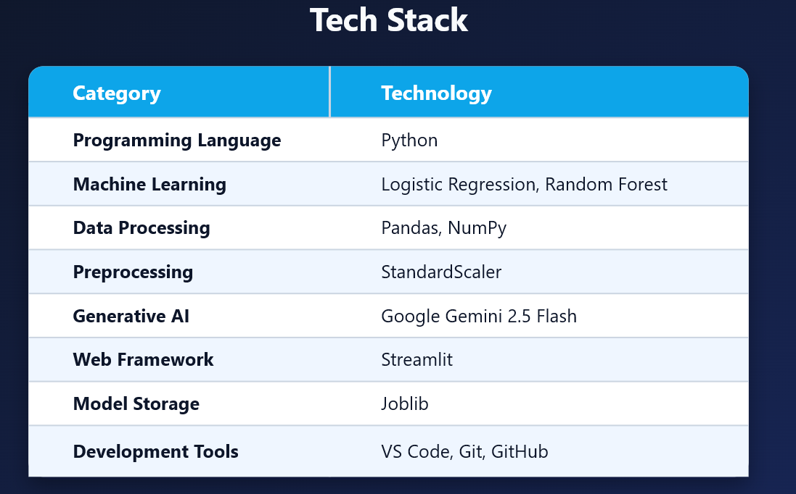
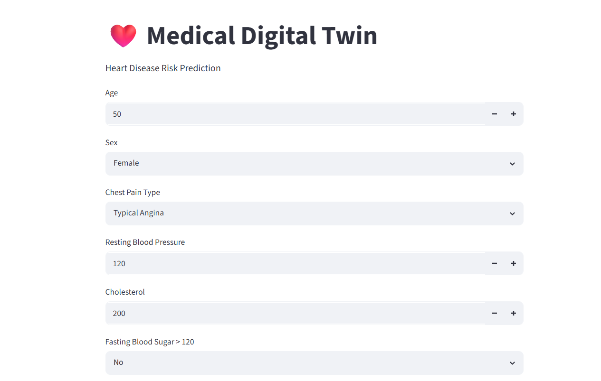
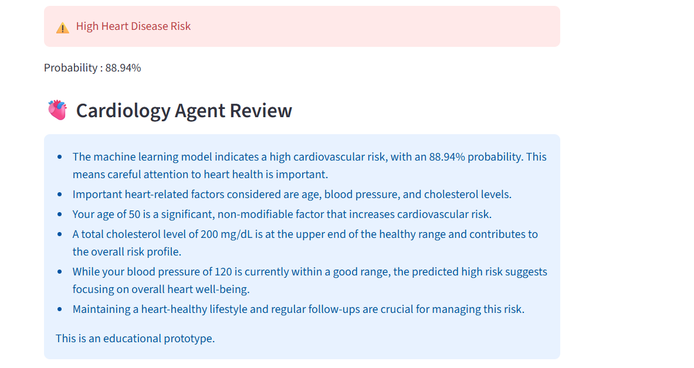
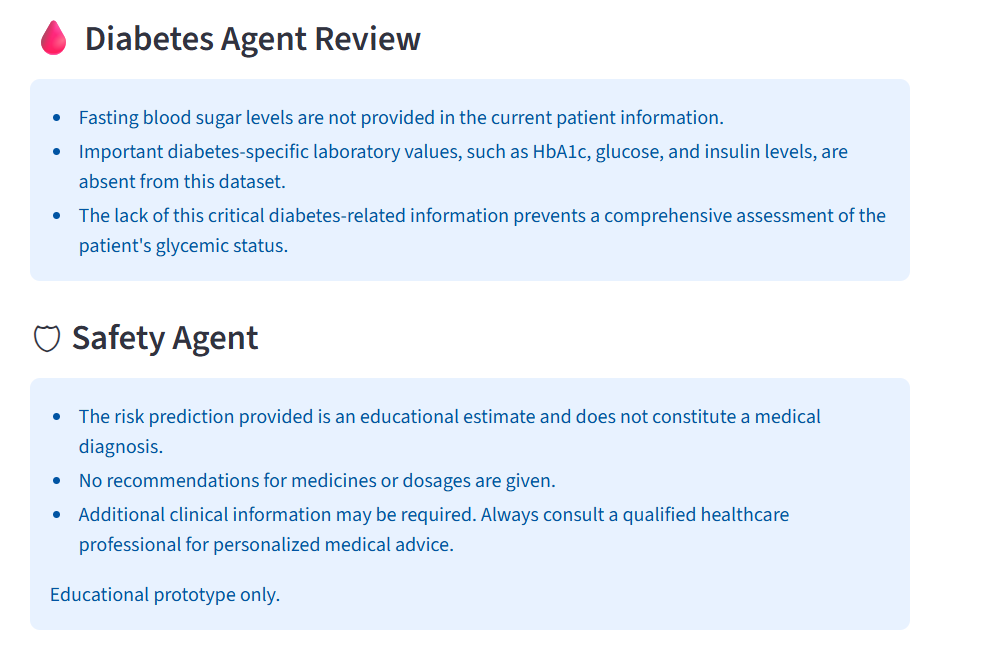
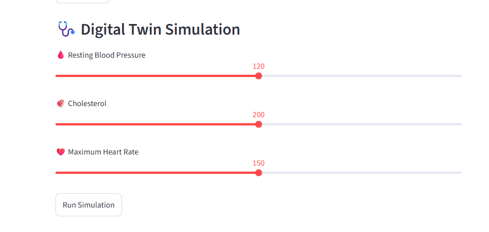
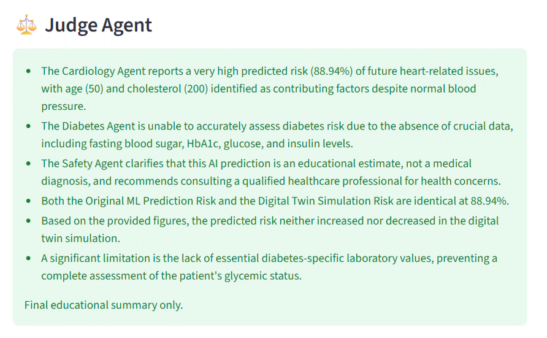

<p align="center">
  
</p>

<h1 align="center">
🩺 AI Multi-Agent Medical Digital Twin
</h1>

<p align="center">
Heart Disease Risk Prediction using Machine Learning, Digital Twin & Multi-Agent AI
</p>
<h2>📖 Project Overview</h2>
Heart disease is one of the leading causes of death worldwide, making early detection and accurate risk assessment essential for improving patient outcomes.
This project introduces an AI-powered Medical Digital Twin that combines Machine Learning, Digital Twin Simulation, and Multi-Agent Artificial Intelligence to deliver personalized, explainable, and interactive heart disease risk prediction.
The system uses a trained Logistic Regression model to estimate cardiovascular risk and provides a probability-based prediction. Users can then explore how changes in key clinical parameters—such as Blood Pressure, Cholesterol, and Maximum Heart Rate—affect the predicted risk through an interactive Digital Twin simulation.
To enhance explainability, the prediction is reviewed by multiple specialized AI agents, including a Cardiology Agent, Diabetes Agent, Safety Agent, and Judge Agent. Each agent contributes a unique perspective, enabling users to better understand the prediction while promoting transparency and responsible AI in healthcare.
This project demonstrates how Machine Learning, AI Agents, and Digital Twin technology can work together to support intelligent, explainable, and patient-centric healthcare decision support.
<h1>✨ Key Features</h1>

✅ ❤️ Heart Disease Risk Prediction

✅ 🤖 AI Multi-Agent System

✅ 🧬 Digital Twin Simulation

✅ 📊 Interactive Streamlit Dashboard

✅ 🔒 Explainable & Educational AI
<h2>🏗️ System Architecture</h2>

<h2>🚀 Workflow</h2>

1. 👤 User enters patient details through the Streamlit dashboard.
2. ⚙️ Input data is preprocessed using the trained StandardScaler.
3. ❤️ Logistic Regression predicts the probability of heart disease.
4. 🤖 AI agents analyze the prediction from different medical perspectives.
5. 🧬 Digital Twin simulates changes in patient health parameters.
6. 📊 The system compares the original and simulated risk predictions.
7. ⚖️ Judge Agent generates the final educational summary.
<h2>🛠️ Tech Stack</h2>

---

<h1>📸 Application Screenshots</h1>

### 🏠 Home Page




### 🤖 AI Multi-Agent Analysis




### 🧬 Digital Twin Simulation



### ⚖️ Judge Agent Summary




<h2>⚙️ Installation</h2>

```bash
git clone https://github.com/your-username/medical_twin_agent.git

cd medical_twin_agent

pip install -r requirements.txt

streamlit run streamlit_app.py
```
---

<h1>🔮 Future Scope</h1>

- 🏥 Integration with Electronic Health Records (EHR)
- ⌚ Support for wearable health devices
- 🌍 Cloud deployment for real-time access
- ❤️ Multi-disease prediction
- 🤖 Advanced AI Agents with MCP integration
- 📈 Improved Digital Twin simulations
---

<h1>📜 License</h1>

This project is developed for educational and research purposes.


